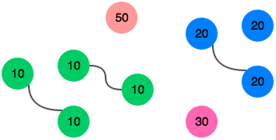

# Sock Merchant <a href="#f1" id=note1ref>1 </a>

## Problem

John works at a clothing store. He has a large pile of socks that he must pair by color for sale. Given an array of integers representing the color of each sock, determine how many pairs of socks with matching colors there are.

For example, there are `n = 7`
socks with colors `ar = [1,2,1,2,1,3,2]`. There is one pair of color `1` and one of color `2`. There are three odd socks left, one of each color. The number of pairs is `2`.

### Function Description

Complete the sockMerchant function in the editor below. It must return an integer representing the number of matching pairs of socks that are available.

sockMerchant has the following parameter(s):

* `n`  :  the number of socks in the pile
* `ar` : the colors of each sock

### Input Format

The first line contains an integer `n`, the number of socks represented in `ar`.

The second line contains space-separated integers describing the colors `ar[i]` of the socks in the pile.

### Constraints

* 
* 

### Output Format

Return the total number of matching pairs of socks that John can sell.

### Sample Input

    9
    10 20 20 10 10 30 50 10 20

### Sample Output

    3

### Explanation

### Reference

<b id="f1">[1] https://www.hackerrank.com/challenges/sock-merchant </b>